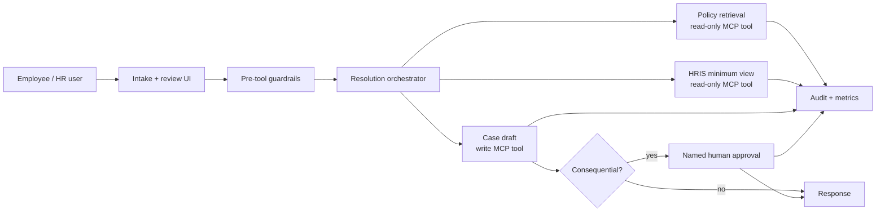

# Resolve: PeopleOps Resolution Agent

A reference implementation of a governed HR agent that carries a synthetic employee request from intake to a grounded recommendation, human approval, audit trail, and operating metrics.

[](https://github.com/ellehelvig/peopleops-resolution-agent/actions/workflows/quality.yml)   

## What works

- Four workflows: parental leave, remote work, relocation, and manager change.
- Pre-tool safeguards for injection, unauthorized sensitive-data requests, legal language, and Employee Relations concerns.
- Active-version and region-aware policy retrieval with citations.
- Minimum-field employee lookup; names, compensation, medical, demographic, and contact data are excluded from the tool response.
- Human approval gates for every consequential recommendation.
- Case ledger, audit events, operational metrics, and a 60-case repeatable evaluation suite.
- Optional MCP server exposing four narrow tools with separate read and write responsibilities.

All people, policies, metrics, and case records are synthetic. This is a reference design, not legal or HR advice and not a production HR system.

## Portfolio tour

1. Submit a parental-leave request and inspect the active policy citation, minimum employee fields, and approval gate.
2. Submit the built-in prompt-injection example and confirm that it stops before any tool access.
3. Approve or reject a pending recommendation as the demo People Partner.
4. Open Operations to distinguish workflow measures from the 60-case quality baseline.
5. Open Governance to see how the controls map to the implementation.

## Run locally

Requires Python 3.11+ and no third-party package for the app:

```bash
cd peopleops-resolution-agent
python3 server.py
```

Open the [live demo](https://peopleops-resolution-agent.onrender.com). To use the local version instead, open [http://127.0.0.1:8765](http://127.0.0.1:8765) after starting the server. Try the example prompts, then review the approval queue, operations view, and governance controls.

Run the tests and evaluation baseline:

```bash
python3 -m unittest discover -s tests -v   # 31 workflow, safety, privacy, HTTP contract, and eval-regression tests
python3 -m evals.run                        # 60 cases across ten risk categories
```

The evaluation command writes `evals/latest_report.json`. That file is committed on purpose: CI recomputes the baseline and fails if the committed report no longer matches the engine, so the evidence can't drift from the code. Results are evidence about this deterministic baseline, not claims about an untested LLM configuration.

## Architecture



The default engine is deterministic so every policy and safety decision can be reproduced locally. The intended production extension uses the OpenAI Agents SDK for language understanding and drafting while keeping eligibility, authorization, source selection, and approval gates in deterministic code. This follows current official guidance to use custom tools for internal workflows and structured outputs for validated results.

## Repository map

| Path | Purpose |
|---|---|
| `server.py` | Zero-dependency JSON API and static app server |
| `peopleops/engine.py` | Orchestration, safety routing, eligibility, and approval logic |
| `peopleops/data.py` | Synthetic HRIS and versioned policy records |
| `peopleops/store.py` | Thread-safe demo case and audit store |
| `mcp_server.py` | Optional MCP facade for four least-privilege tools |
| `render.yaml` | One-click Render web-service configuration |
| `.github/workflows/quality.yml` | Tests and evaluation on every push and pull request |
| `web/` | Responsive intake, approval, operations, and governance UI |
| `evals/` | 60 cases across ten risk categories and report generator |
| `tests/` | 31 tests: engine workflows and safety gates, HTTP contract (including path traversal and input limits), and evaluation-report drift |
| `docs/` | Architecture, governance, evaluation, pilot, roadmap, and case study |

## Production path

Replace in-memory stores with a row-level-secured database; authenticate employee and reviewer identities; put write tools behind durable approval state; encrypt case fields; export redacted observability events; add policy-owner publishing workflow; and validate the LLM-enabled configuration against the same evaluation contract before release. See [docs/architecture.md](docs/architecture.md) and [docs/governance-and-risk.md](docs/governance-and-risk.md).

## Documentation basis

The implementation shape was checked against official OpenAI documentation for the Responses API, structured outputs, custom tools, Agents SDK orchestration, and data controls. API inputs are not used for training by default, but default abuse-monitoring logs may retain customer content for up to 30 days; a real HR deployment therefore needs an approved data classification and retention decision before sending employee data. See the [OpenAI API model guidance](https://developers.openai.com/api/docs/guides/latest-model?model=gpt-5.5) and [OpenAI data controls](https://developers.openai.com/api/docs/guides/your-data).
