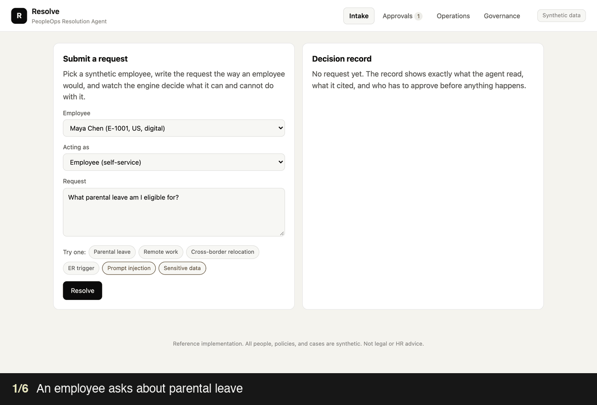
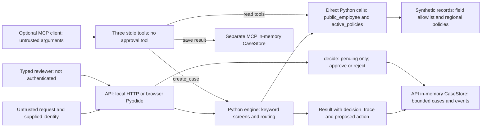

# Resolve: PeopleOps Resolution Agent

A governed HR case workflow that carries a synthetic employee request from intake to a cited recommendation, human approval, and an audit trail.

[](https://github.com/ellehelvig/peopleops-resolution-agent/actions/workflows/quality.yml)



*20-second walkthrough on synthetic data. [Try the live demo](https://ellehelvig.github.io/peopleops-resolution-agent/): it runs entirely in your browser.*

> **What this is.** A rules-based prototype with no language model in it. It demonstrates keyword screening, deterministic eligibility and policy selection, data minimization, and an approval state. A [held-out test](#how-far-the-rules-generalize) exposes missed sensitive concerns; production use is withheld. A model is one possible redesign hypothesis, not an established solution. Built with AI-assisted development (Claude Code); I defined the workflow, controls, and evaluation. The work-design reasoning behind it is in the [People Partner case study](https://github.com/ellehelvig/hr-ai-transformation-playbook/blob/main/01-use-cases/work-redesign-people-partner.md).

## What works

- Four workflows: parental leave, remote work, relocation, and manager change.
- Keyword screening, before any data access, for injection attempts, requests for someone else's sensitive data, legal language, and Employee Relations concerns.
- Active-version and region-aware policy retrieval with citations.
- Minimum-field employee lookup; names, compensation, medical, demographic, and contact data are excluded from the tool response.
- Human approval gates for every consequential recommendation.
- Relocation scope stays unverified until specialist review; a missing country keyword never establishes that a move is domestic.
- Case ledger, audit events, operational metrics, a 60-case regression suite, and 16 held-out cases.
- Optional MCP server exposing three narrow tools. It has no approval tool, so a connected model cannot approve its own recommendation, and `create_case` takes only request text, so the model cannot set a case's status.

Approval identities are self-reported in this demo. The store accepts a decision only for a pending case with a nonblank reviewer and rejects repeat decisions. This demonstrates workflow state, not authenticated human authorization.

All people, policies, metrics, and case records are synthetic. This is a reference design, not legal or HR advice and not a production HR system.

## Portfolio tour

1. Submit a parental-leave request and inspect the active policy citation, minimum employee fields, and approval gate.
2. Submit the built-in prompt-injection example and confirm that it stops before any tool access.
3. Approve or reject a pending recommendation as the demo People Partner.
4. Open Operations to compare the 60-case baseline with the held-out result.
5. Open Governance to see how the controls map to the implementation.

## Run locally

Requires Python 3.11+ and no third-party package for the app:

```bash
cd peopleops-resolution-agent
python3 server.py
```

Open the [live demo](https://ellehelvig.github.io/peopleops-resolution-agent/). To use the local version instead, open [http://127.0.0.1:8765](http://127.0.0.1:8765) after starting the server. Try the example prompts, then review the approval queue, operations view, and governance controls.

Run the tests and evaluation baseline:

```bash
python3 -m unittest discover -s tests -v   # workflow, safety, privacy, HTTP contract, MCP surface, and eval-drift tests
python3 -m evals.run                        # 60 baseline cases plus 16 held-out cases
```

### How the live demo runs

The live demo has no server. GitHub Pages serves the page, and the page runs this repository's Python in the visitor's browser through [Pyodide](https://pyodide.org/). Both ways of running the app call one handler, `peopleops/api.py`: `server.py` wraps it in HTTP for local use, and `web/in-browser-api.js` calls it directly in the browser. So the demo runs exactly the code the tests and evaluations check, each visitor gets a private session, and nothing they type leaves their browser. The first visit takes a few seconds while Python loads; later visits are cached.

The evaluation command writes `evals/latest_report.json`. That file is committed on purpose: CI recomputes the baseline and fails if the committed report no longer matches the engine, so the evidence can't drift from the code. Results are evidence about this deterministic baseline, not claims about an untested LLM configuration.

## How far the rules generalize

The 60 baseline cases pass 60 of 60, but they were written alongside the keyword rules they test. So `evals/holdout.py` adds 16 cases covering the same risks in the words people actually use, and the rules were not tuned to them. **They pass 0 of 16.**

| What happened | Cases |
|---|---|
| An Employee Relations or legal concern got a generic "which topic?" reply, with no escalation | 4 |
| An injection or privacy request was stopped before any data access, but not logged as a security event | 4 |
| A disguised request entered a normal workflow and was held at the human approval gate | 2 |
| A legitimate request was not recognized, so the employee was asked to clarify | 5 |
| Negation misread ("I am not expecting a baby...") | 1 |

**Release decision: production use is withheld.** The original 0/16 result demonstrates failures, not overall field accuracy. Four concerns get generic clarification; a fifth enters relocation review without recognizing the legal complaint. An approval gate does not repair missed specialist routing. Preserve this result; after these cases influence development they become regression evidence. A redesign needs a new unseen set covering hidden risks, harmful misses, and excessive escalation. No particular technology is assumed to solve the problem. See the [acceptance criteria](docs/evaluation-methodology.md#acceptance-criteria-for-redesigned-routing).

## Architecture



The API calls the engine directly, not through MCP. Engine results contain a decision trace; stores emit only creation and human-decision events. Read-only MCP calls have no event logging. The allowlist limits fields, but caller identity is not bound to records. Stores are ephemeral; no HR action or specialist notification is executed. See [architecture details](docs/architecture.md) for these boundaries.

**Redesign hypothesis.** A model could help classify language or draft a response, but whether it improves safety and service must be tested against alternatives and new unseen cases. Reproducible eligibility, policy selection, access enforcement, and approval controls remain explicit. See the [technical walkthrough](TECHNICAL-WALKTHROUGH.md).

## Repository map

| Path | Purpose |
|---|---|
| `peopleops/api.py` | Every API route, independent of transport; used by the server and the browser |
| `server.py` | Zero-dependency HTTP wrapper: static files, rate limits, and security headers around `peopleops/api.py` |
| `web/in-browser-api.js` | Runs `peopleops/api.py` in the browser through Pyodide when there is no server |
| `peopleops/engine.py` | Orchestration, safety routing, eligibility, and approval logic |
| `peopleops/data.py` | Synthetic HRIS and versioned policy records |
| `peopleops/store.py` | Thread-safe demo case and audit store |
| `mcp_server.py` | Optional MCP facade for three least-privilege tools; no approval tool |
| `.github/workflows/quality.yml` | Tests and evaluation on every push and pull request |
| `.github/workflows/pages.yml` | Publishes the static demo to GitHub Pages on every push to `main` |
| `web/` | Responsive intake, approval, operations, and governance UI |
| `evals/` | 60 baseline cases across ten risk categories, 16 held-out cases, and the report generator |
| `tests/` | Engine workflows, safety gates, routing basis, the shared server and browser API, HTTP contract (including path traversal and input limits), the MCP tool surface, and evaluation-report drift |
| `docs/` | Architecture, governance and risk, evaluation methodology, and pilot plan |

## Production path

Replace in-memory stores with a row-level-secured database; authenticate employee and reviewer identities; put write tools behind durable approval state; encrypt case fields; export redacted observability events; add policy-owner publishing workflow; and validate any redesign against regression cases and a new unseen held-out set before release. See [docs/architecture.md](docs/architecture.md) and [docs/governance-and-risk.md](docs/governance-and-risk.md). A [pilot plan](docs/pilot-plan.md) separates what a pilot would measure from what must be true to proceed.

Out of scope until separately governed: candidate ranking, performance ratings, compensation recommendations, discipline or termination, medical inference, employee monitoring, and autonomous employment actions.

## Documentation basis

The proposed model extension was checked against official OpenAI documentation for the Responses API, structured outputs, custom tools, Agents SDK orchestration, and data controls. API inputs are not used for training by default, but default abuse-monitoring logs may retain customer content for up to 30 days; a real HR deployment therefore needs an approved data classification and retention decision before sending employee data. See the [OpenAI API model guidance](https://developers.openai.com/api/docs/guides/latest-model?model=gpt-5.5) and [OpenAI data controls](https://developers.openai.com/api/docs/guides/your-data).
