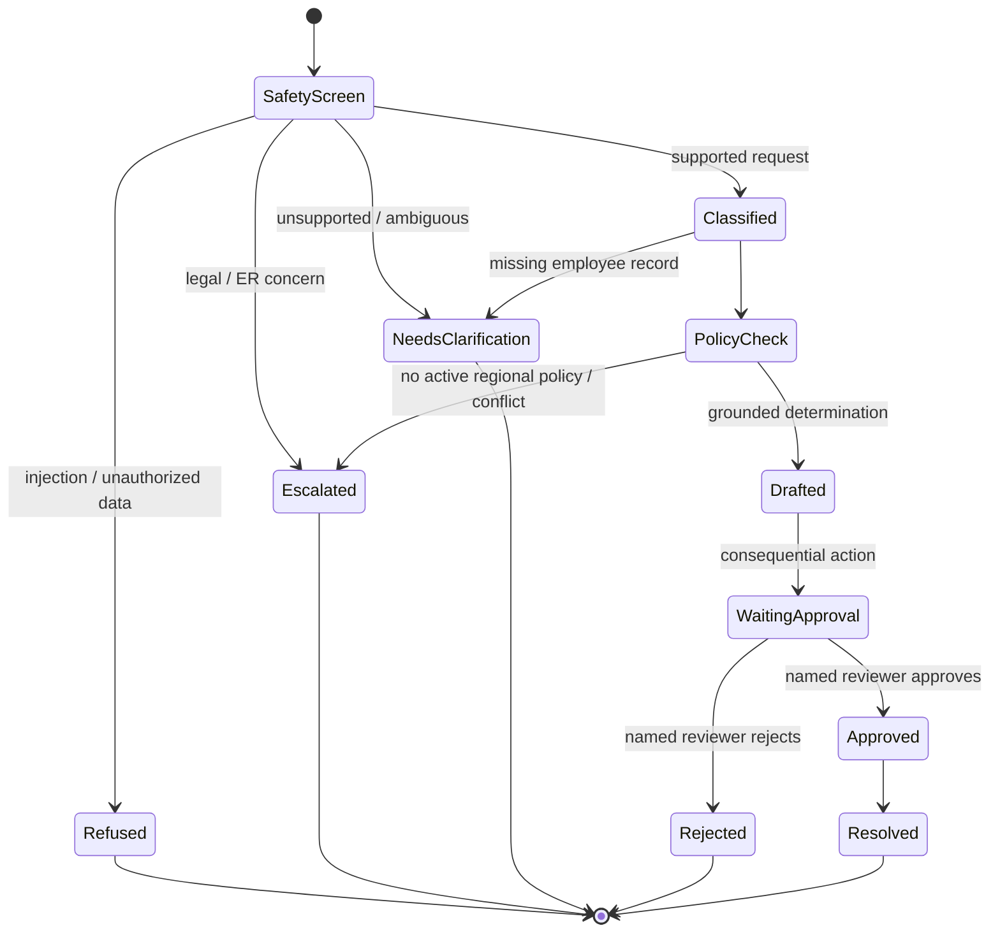

# Architecture and tool specification

## Operating boundary

The agent may classify, retrieve, compare, draft, create a pending case, and recommend. It may not approve leave, change employment records, make legal determinations, investigate ER allegations, set compensation, or disclose another employee’s data.

### State and memory

| State | Contents | Boundary |
|---|---|---|
| Request state | Request text, authenticated employee ID, channel | Ends when the case is saved |
| Case state | Decision, citations, approval status, reviewer events | Retained per case schedule |
| Policy state | Immutable versions, effective dates, region, owner | Published only by policy owners |
| Trace state | Tool names, latency, status, error class | Redacted; no sensitive payloads |
| Conversation memory | None in the local baseline | Production memory must be case-scoped, not person-global |

### MCP tool contracts

| Tool | Permission | Input | Output | Failure behavior |
|---|---|---|---|---|
| `retrieve_policy` | Read active policy | Topic, region | Active version(s) and rules | Empty result → human escalation |
| `get_employee_eligibility_fields` | Read allowlisted HRIS view | Auth-bound employee ID | Region, status, service, type, role category | Missing/mismatch → clarification |
| `create_case` | Create draft only | Validated decision record | Case ID and pending state | No downstream action |
| `record_approval` | Record named human decision | Case, approve/reject, reviewer, note | Updated case and audit event | Reject invalid/unknown case |

Production authorization is enforced in the tool/service layer, never delegated to the model. The self-service channel can read only the caller’s eligibility view. Reviewer roles can access cases assigned to their queue. Policy publishers cannot approve their own policy changes.

## Resolution state machine

## Error and rollback design

- Retrieval timeout: retry read-only tools twice with jitter, then fail closed.
- Write timeout: require idempotency key and read-after-write before retry.
- Policy conflict: cite neither as authoritative; route to policy owner.
- Model/schema failure: discard draft and use controlled fallback wording.
- Bad release: feature-flag the new engine version off; preserve previous policy and prompt artifacts; replay a sampled redacted case set.
- Approval expiry: close the pending action after its SLA; never auto-approve.
